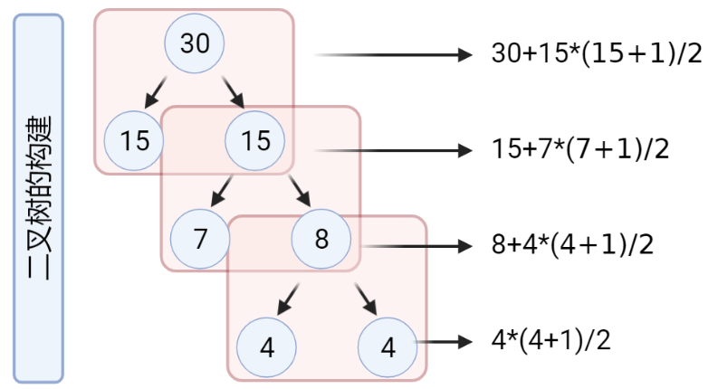

# 2020华东杯数学建模c题

>  很多回答中，此题目的最小值为162，但是我的结果是184。仅代表自己的观点，欢迎交流。

## 题目

减少药片污染问题

打开药瓶时，瓶内的药片可能会受到污染。如果每次打开药瓶倒出若干药，服用或放入另一瓶中，每片药片都会受到一次污染。某人每天要服用一片这种药，为了减少药片的总污染程度，他想到了一种方法，如原药瓶中有10片药，将4片药倒入一个空瓶中，药片污染次数是10片次，原药瓶中剩下6片。从装有4片药的瓶中取出1片服用，该瓶中的药又被污染了4片次。如再把装有6片药的瓶中倒3片到一个空瓶中，污染次数又会增加6片次。请对一般情况给出使得总污染数最小的方案，并给出30片药的具体方案。

## 解题

本题目中我们采用了遍历、二叉树表示的方法进行求解最小值。首先我们定义在一种分发下，药品污染的数量。

>  这里我们注意题目中所给的，取药和分药是分开进行的，我们都需要考虑药品污染。

这里我们给出了在某种情况下药品污染的计算，如下图所示。

在此我们给定几个已知信息：

1. 若瓶中的药片数量小于或等于4，则不用再分瓶
2. 每次分瓶后都要吃完再进行分瓶，这样的污染数量是最小的。

所以我们利用二叉树对整个过程进行分析：

$$
[X_{left},data,X_{right}]
$$
其中 $X_{left}$ 表示分出去的药片数量，将会依次吃完，总体的药片污染数量为：

$$
(X_{left}+1)X_{left}/2
$$

$data$表示分瓶之前的药片数量，有：

$$
data = X_{left} + X_{right}
$$

$X_{right}$表示剩余的药片数量，在下一个过程中将等同于$data$。

利用递归策略进行遍历，求解出所有的二叉树，并求解最小的药片污染。

